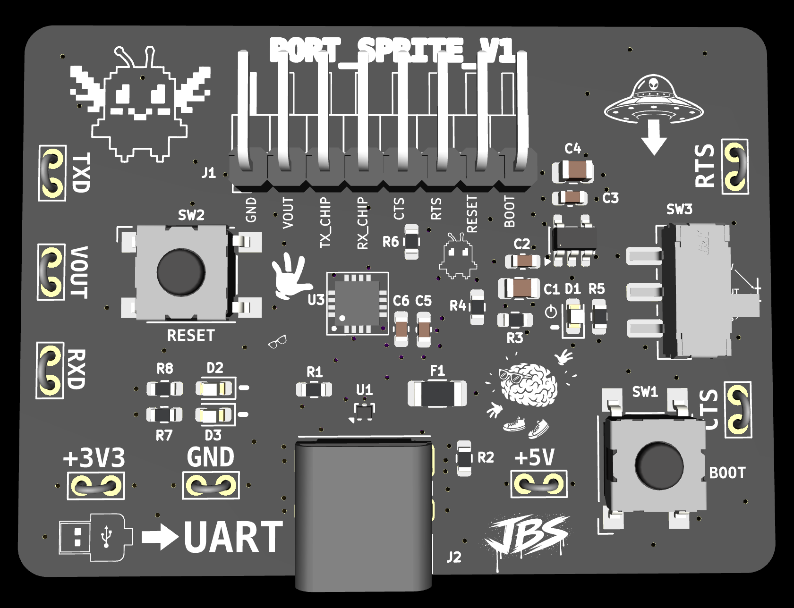
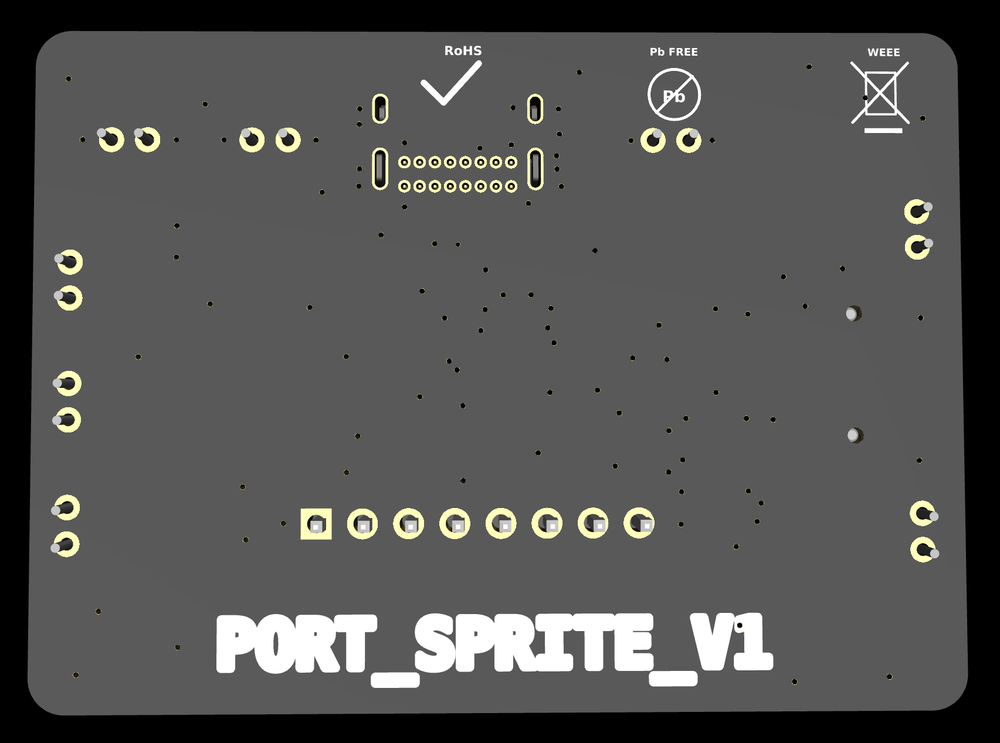

# PORT_SPRITE

<p align="center">
  
</p>

<p align="center">
  
</p>

Compact USB-C to UART debug/programming interface for embedded hardware projects.

PORT_SPRITE is a reusable bench tool for custom PCB bring-up. It provides USB-C serial access, 3.3V UART logic, selectable target power output, activity LEDs, reset/boot controls, and labeled test points so new boards can be programmed, tested, and debugged without rebuilding the same support circuit every time.

> USB in. UART out. Tiny port familiar doing serial errands.

## Project Status

| Item | Value |
|---|---|
| Revision | V1 |
| Status | In layout / pre-fabrication review |
| EDA | KiCad |
| Board type | USB-C to UART debug interface |

## System Role

```text
Computer / USB-C
        ↓ USB 2.0
PORT_SPRITE / CP2102N
        ↓ UART / reset / boot / VOUT
Target microcontroller board
```

PORT_SPRITE is not the target application board. It is a reusable debug/programming helper for other embedded projects.

## Main Features

- USB-C device input
- CP2102N USB-to-UART bridge
- 3.3V UART logic
- Selectable target power output
  - 3.3V from onboard AP2112K regulator
  - 5V from fused USB VBUS
- Target debug header with GND, VOUT, TXD, RXD, CTS, RTS, RESET, and BOOT_LOW
- Manual RESET button for target board
- Manual BOOT_LOW button for ESP-style boot/GPIO0 workflows
- TX/RX activity LEDs
- Power LED
- USB data ESD protection
- VBUS sense divider for CP2102N
- Exposed test points for key nets

## What This Board Is For

PORT_SPRITE is meant to live on the bench and plug into future embedded projects.

Use it for:

- UART serial logging
- Firmware flashing workflows
- Testing custom target boards
- Bringing up new microcontroller projects
- Probing TX/RX/RTS/CTS/VOUT rails
- Powering small target boards from USB
- ESP-style BOOT/RESET programming workflows

## Key Specs

| Item | Value |
|---|---|
| USB-UART bridge | CP2102N-Axx-xQFN20 |
| USB connector | USB-C USB 2.0 receptacle |
| UART logic level | 3.3V |
| Target power output | Selectable 3.3V or fused USB 5V |
| Regulator | AP2112K-3.3 |
| USB ESD | TPD2EUSB30 or equivalent |
| Target header | 1x8 UART/debug header |
| Manual controls | RESET and BOOT_LOW buttons |
| Indicators | Power LED, TX LED, RX LED |
| Board role | USB-C UART/debug/programming helper |

## Important Electrical Behavior

### UART Logic Level

The UART signal pins use **3.3V logic**.

The `VOUT` selector can provide either 3.3V or 5V power to the target, but the UART logic does **not** become 5V logic.

```text
UART TX/RX/CTS/RTS logic level = 3.3V
VOUT selectable rail            = 3.3V or 5V
```

Do not connect PORT_SPRITE UART pins directly to a target that drives 5V logic unless level shifting or 5V tolerance is confirmed.

### VOUT Selector

The slide switch selects what voltage appears on the `VOUT` pin.

| Switch input | Source |
|---|---|
| `+3V3` | AP2112K 3.3V regulator output |
| `VBUS_5V` | Fused USB 5V rail |

`VOUT` is intended for small target boards only. Do not use it as a high-current supply.

### BOOT_LOW

`BOOT_LOW` is a pull-low boot control intended for ESP-style boot/GPIO0 workflows.

For STM32-style BOOT0, confirm the target board requirements before use. STM32 BOOT0 often expects pull-high behavior instead.

## Target Header Pinout

| Pin | Signal | Direction / Purpose |
|---:|---|---|
| 1 | GND | Ground reference |
| 2 | VOUT | Selected target power output |
| 3 | TXD_TO_TARGET_RX | PORT_SPRITE TXD to target RX |
| 4 | RXD_FROM_TARGET_TX | Target TX to PORT_SPRITE RXD |
| 5 | CTS | CP2102N CTS |
| 6 | RTS | CP2102N RTS |
| 7 | RESET | Target reset, button pulls low |
| 8 | BOOT_LOW | Target boot/GPIO0, button pulls low |

## Typical Target Wiring

UART wiring crosses TX and RX:

```text
PORT_SPRITE TXD_TO_TARGET_RX  → target RX
PORT_SPRITE RXD_FROM_TARGET_TX ← target TX
PORT_SPRITE GND               ↔ target GND
PORT_SPRITE VOUT              → optional target power input
```

RESET and BOOT_LOW are optional and depend on the target board design.

## Test Points

| Test Point | Net | Purpose |
|---|---|---|
| TP1 | GND | Ground reference |
| TP2 | VBUS_5V | USB 5V rail check |
| TP3 | +3V3 | 3.3V regulator output check |
| TP4 | RXD_FROM_TARGET_TX | UART RX probe point |
| TP5 | TXD_TO_TARGET_RX | UART TX probe point |
| TP6 | CTS | Flow-control probe point |
| TP7 | RTS | Flow-control / control probe point |
| TP8 | VOUT | Selected target output voltage |

## Main Components

| Ref | Part | Notes |
|---|---|---|
| U1 | CP2102N-Axx-xQFN20 | USB-to-UART bridge |
| U2 | TPD2EUSB30 or equivalent | USB D+/D- ESD protection |
| U3 | AP2112K-3.3 | 3.3V LDO regulator |
| J1 | USB-C USB 2.0 receptacle | Device/sink input |
| J2 | 1x8 target debug header | UART/debug interface |
| SW1 | SPDT slide switch | Selects VOUT source |
| SW2 | RESET button | Pulls target RESET low |
| SW3 | BOOT button | Pulls BOOT_LOW low |

## Power Architecture

```text
USB-C VBUS
      ↓
fuse / protection
      ↓
VBUS_5V rail
      ↓
AP2112K-3.3 regulator → +3V3
      ↓
VOUT selector chooses +3V3 or VBUS_5V
      ↓
target VOUT pin
```

## Bring-Up Checklist

Before plugging into a computer:

- [ ] Inspect USB-C connector solder joints.
- [ ] Inspect CP2102N orientation.
- [ ] Confirm no solder bridges on QFN pins.
- [ ] Check continuity between all GND points.
- [ ] Confirm `VBUS_5V` is not shorted to GND.
- [ ] Confirm `+3V3` is not shorted to GND.
- [ ] Confirm `VOUT` is not shorted to GND.
- [ ] Confirm USB D+ and D- are not shorted together.
- [ ] Confirm USB D+ and D- are not shorted to GND or VBUS.

Power checks:

- [ ] Plug into a current-limited USB source or USB power meter first.
- [ ] Measure `VBUS_5V`.
- [ ] Measure `+3V3`.
- [ ] Toggle VOUT selector and measure `VOUT` in both positions.
- [ ] Confirm PWR LED behavior.

USB checks:

- [ ] Confirm the board enumerates as a CP210x USB-to-UART device.
- [ ] Confirm TX/RX LEDs behave during serial activity.
- [ ] Perform loopback test between TXD and RXD.

## Loopback Test

Connect:

```text
TXD_TO_TARGET_RX ↔ RXD_FROM_TARGET_TX
```

Open a serial terminal. Any typed characters should echo back.

Suggested settings:

```text
Baud: 115200
Data: 8
Parity: none
Stop: 1
Flow control: none
```

## Design Notes

- Label TX/RX from PORT_SPRITE's point of view.
- UART wiring crosses TX to RX and RX to TX.
- Always share GND with the target board.
- Keep USB D+ and D- short and clean.
- Keep connector labels readable for fast bench use.
- Do not assume every target board is 5V tolerant.
- Treat VOUT as a convenience rail, not a high-current bench supply.

## Notes For Future Revision

Potential V2 ideas:

- Add true auto-reset/auto-boot support with DTR/RTS using a USB-UART bridge/package that exposes DTR.
- Add 1.8V logic support.
- Add target voltage sensing.
- Add USB isolation.
- Add current limiting or current measurement on VOUT.
- Add alternate pinout adapter cables.

## Repository Output Images

Expected image paths for GitHub README rendering:

```text
Outputs/
  IMG/
    3D-T.png
    3D-B.png
    SCHEMATIC.png
    L1-SIG.png
    L2-GND.png
```

## Safety / Design Note

PORT_SPRITE is a low-voltage debug/helper PCB. Verify UART voltage levels, shared ground, selected VOUT voltage, and target pin direction before connecting it to another project.

Designed & engineered by Brandon Shelly